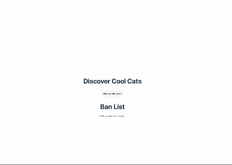

# CATS
CATS is based on the now-defunct StumbleUpon, which allows users to discover new things by clicking through random new stuff.

Users will be able to: 
- discover new cats by clicking discover new cat button
- display one cat at a time with information through API calls in a random fashion
- influence what they want to see next via a ban list


**The following **required** functionality is completed:**

- [x] Clicking a button creates a new API fetch request and displays at least three attributes from the returned JSON data

- [x] Only one item/API call is viewable at a time

- [x] API calls should appear random to the user

- [x] At least one image is displayed per API call

- [x] Clicking on a displayed value for one attribute adds it to a displayed ban list

- [x] Attributes on the ban list prevent further images/API results with that attribute from being displayed

**The following **optional** functionality are implemented:**

- [x] Multiple types of attributes can be added to the ban list

- [ ] Users can see a stored history of their previously viewed items from this session

# Here's how CATS looks:



# Getting started
**Install dependencies**
```
npm install
```

**Run the application in developer mode**

```
npm run dev
```

**Open project in the browser**

In the command line Vite will display a link, such as http://127.0.0.1:5173 to click on or copy/paste that will take you to the localhost port where the project is running.

**Tip:** If you'd like to stop the server, you can use ctrl + c or cmd + c within the Terminal, or use the trash can icon in the top right of the Terminal within VS Code. To run the server again, simply use npm run dev again.